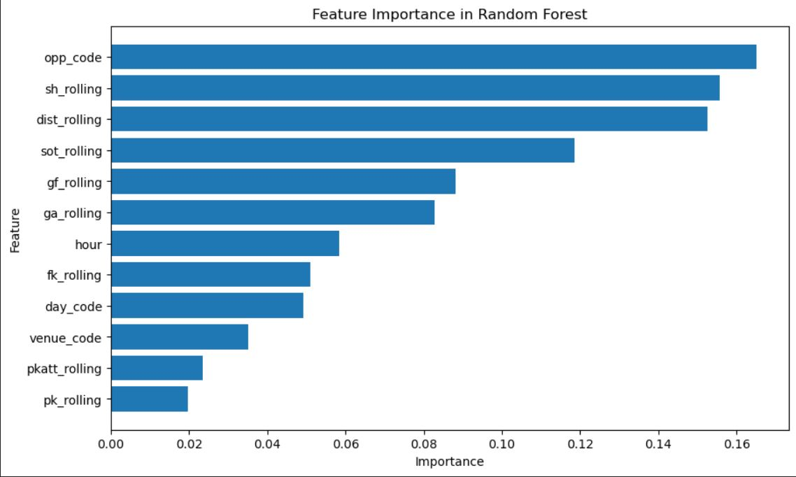

Using Random Forests to predict match outcomes for the 2023-2024 English Premier League season

1st Iteration Acc and Precision: 
- acc: .595 and prec: .472

2nd Iteration (Added new rolling avg predictors to account for how the team performed in previous games leading up to the current one)
- acc: .659 and prec: .591
- Beats 61.4% model accuracy noted in a paper produced by the University of Innsbruck 

3rd Iteration (Hyperparameter Tuning via Grid Search Cross Validation)
- acc: .662 and prec: .598

Note - Balanced Results class: 
- W:2024
- L:2018
- D:1179

Boosts confidence that the acc metric of the model is indeed a robust indicator of good model performance due to the balanced classes

Overall Remarks: 
- Trained a Random Forest model to predict 2023-2024 English Premier League match outcomes with a 66.2% accuracy, outperforming the University of Innsbruck's model by 4.8%.
- Improved model accuracy by 11% by adding new column predictors and performing hyperparameter tuning via Grid Search Cross Validation.
- Scraped 5000+ rows of reliable data from the web using the requests library and Beautiful Soup, to build the dataset for model training/validation.
- Tech Used: Python, BeautifulSoup, Pandas, Sklearn

Appendix - Feature Importance:
